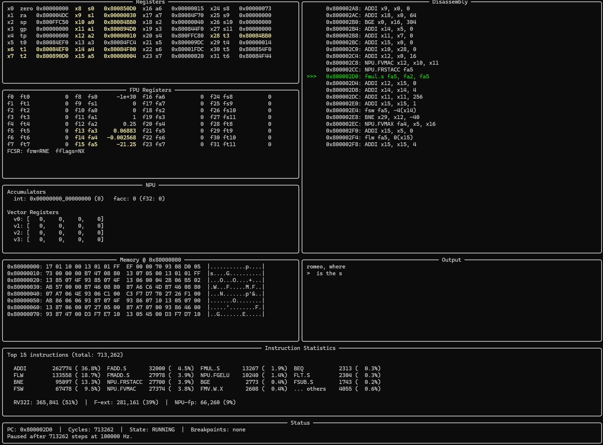

# riscv-npu

RISC-V (RV32IMF) emulator in Python with custom NPU instructions for neural network inference.

## Features

| Feature                      | Details                                                          |
|------------------------------|------------------------------------------------------------------|
| ISA support                  | RV32I (41 instructions) + M extension (8) + F extension (26)    |
| Custom NPU (integer)         | 14 instructions for quantized int8 inference (opcode 0x0B)      |
| Custom NPU (floating-point)  | 10 instructions for float32 inference (opcode 0x2B)             |
| Total instructions           | 99 (75 standard RISC-V + 24 custom NPU)                        |
| Memory model                 | 4 MB RAM, memory-mapped UART (16550), memory-mapped NPU regs   |
| ELF loader                   | Full ELF32 RISC-V parser with symbol table lookup               |
| Syscalls                     | Linux ABI: read, write, exit, brk                               |
| TUI debugger                 | Registers, FPU, NPU, disassembly, memory, UART, instruction stats |
| Firmware examples            | 9 programs from fibonacci to a trained transformer LM           |
| Test coverage                | 900+ tests, all passing                                         |

## Prerequisites

- Python 3.14+
- [uv](https://docs.astral.sh/uv/) package manager
- RISC-V cross-compiler (`riscv64-unknown-elf-gcc`) for building firmware

## Setup

```bash
uv sync
```

## Running programs

Run an ELF binary headless:

```bash
uv run python -m riscv_npu run firmware/fibonacci/fibonacci.elf
```

The emulator prints the cycle count and the values in registers `a0`/`a1` on exit. The process exit code matches the program's return value (`a0`).

## TUI debugger

Launch the interactive debugger:

```bash
uv run python -m riscv_npu debug firmware/hello/hello.elf
```

The debugger displays panels for registers, disassembly, memory hex dump, UART output, FPU state, NPU state (integer + float accumulators, vector registers), and instruction statistics. Changed values are highlighted after each step.



Use `--write SYMBOL:FILE` to load file contents into memory at an ELF symbol's address before execution. This is useful for injecting test data (e.g. weight files or input images) into firmware buffers.

### Debugger commands

| Command                | Description                                   |
|------------------------|-----------------------------------------------|
| `s` / `step`           | Execute one instruction                       |
| `c` / `continue`       | Run until breakpoint or halt                  |
| `r` / `run <hz> [max]` | Run at fixed speed with live display (Ctrl+C) |
| `b <hex_addr>`         | Toggle breakpoint (e.g. `b 80000010`)         |
| `g <hex_addr>`         | Jump memory view to address                   |
| `h` / `help`           | Show command help                             |
| `q` / `quit`           | Exit debugger                                 |

## Firmware

Firmware programs are C code that runs **on** the emulated CPU. Each program lives in `firmware/<name>/` with its own Makefile.

### Compiling firmware

```bash
cd firmware/hello && make
```

This requires a RISC-V cross-compiler. All firmware is compiled with `-march=rv32imf -mabi=ilp32f` -- the emulator does **not** support the A (atomics) or C (compressed) extensions.

### Example programs

| Program       | Description                                                          |
|---------------|----------------------------------------------------------------------|
| `fibonacci`   | Computes fib(10), returns result in `a0`                             |
| `hello`       | Prints "Hello, World!" via write syscall                             |
| `uart-hello`  | Prints via direct UART register access (memory-mapped I/O)           |
| `sort`        | Insertion sort, returns 1 on success                                 |
| `newton`      | Square roots via Newton's method, verified against fsqrt             |
| `fpu_test`    | Tests all RV32F floating-point instructions (34 checks)              |
| `npu_test`    | Exercises all NPU instructions (MACC, RELU, QMUL, CLAMP, GELU)      |
| `mnist`       | Quantized 784->128->10 MLP, classifies handwritten digits            |
| `transformer` | Float32 char-level transformer LM, trained on Shakespeare (FP NPU)   |

### Generating weights

The `mnist` and `transformer` firmware require exported weight files before compiling.

```bash
# MNIST MLP weights (~100KB, int8 quantized)
uv run --extra torch python -m riscv_npu.tools.export_mnist_weights

# Transformer weights (~527KB, float32, trained on TinyShakespeare)
uv run --extra torch python -m riscv_npu.tools.export_transformer_weights
```

Then compile and run:

```bash
cd firmware/mnist && make
uv run python -m riscv_npu run firmware/mnist/mnist.elf

cd firmware/transformer && make
uv run python -m riscv_npu run firmware/transformer/transformer.elf
```

The transformer generates text autoregressively -- it echoes the input prompt, then prints generated characters on a second line prefixed with `>`.

## Testing

```bash
uv run pytest              # all tests
uv run pytest tests/cpu/ -v  # CPU tests only
uv run pytest -x           # stop on first failure
```

## Architecture

```
                      +---------------------------+
                      |          CLI              |
                      |   run / debug commands    |
                      +----------+----------------+
                                 |
                      +----------v----------------+
                      |        CPU Core           |
                      |  fetch -> decode -> exec  |
                      +--+-----+-----+-----+------+
                         |     |     |     |
               +---------+   +-+   +-+   +-+--------+
               |             |     |     |          |
        +------v-------+ +---v---+ |  +--v---+ +----v----+
        | RegisterFile | | FPU   | |  | NPU  | | Syscall |
        | x0-x31       | | f0-f31| |  | int  | | Handler |
        +--------------+ | fcsr  | |  | fp   | +---------+
                         +-------+ |  +------+
                                   |
                       +-----------v-----------+
                       |      Memory Bus       |
                       +--+--------+--------+--+
                          |        |        |
                   +------v--+ +---v----+ +-v----------+
                   |   RAM   | | UART   | | NPU MMIO   |
                   | 4 MB    | | 16550  | | debug regs |
                   +---------+ +--------+ +------------+
```

### Source layout

```
src/riscv_npu/
  cpu/       -- decode + execute (the core loop)
  memory/    -- bus, RAM, device base class
  devices/   -- UART, NPU (memory-mapped I/O)
  loader/    -- ELF parser
  syscall/   -- ecall dispatch
  npu/       -- custom NPU instruction execution + compute engine
  tools/     -- weight export, assembler utilities
  tui/       -- Rich-based terminal debugger
firmware/    -- C programs that run on the emulator
```

## NPU instruction set

The NPU provides hardware-accelerated neural network operations via two custom instruction sets encoded in the RISC-V custom opcode space.

### Integer NPU (opcode 0x0B) -- 14 instructions

Designed for quantized int8 inference with a 64-bit integer accumulator. Key instructions:

| Instruction   | Operation                                                  |
|---------------|------------------------------------------------------------|
| NPU.VMAC      | Vector dot product: acc += dot(int8[rs1], int8[rs2], n)    |
| NPU.RSTACC    | Read accumulator to rd, reset to zero                      |
| NPU.RELU      | Scalar ReLU: rd = max(signed(rs1), 0)                      |
| NPU.GELU      | Scalar GELU via 256-entry lookup table                     |
| NPU.QMUL      | Quantized multiply: rd = (rs1 * rs2) >> 8                  |
| NPU.CLAMP     | Clamp to int8 range: rd = clamp(rs1, -128, 127)            |
| NPU.VEXP      | Vector exp over Q16.16 array                               |
| NPU.VRSQRT    | Scalar 1/sqrt in Q16.16                                    |
| NPU.VMUL      | Vector scale by accumulator value                          |
| NPU.VREDUCE   | Vector sum reduction                                       |
| NPU.VMAX      | Vector max reduction                                       |
| NPU.MACC      | Scalar multiply-accumulate                                 |
| NPU.LDVEC     | Load 4 bytes into vector register                          |
| NPU.STVEC     | Store vector register to memory                            |

### Floating-point NPU (opcode 0x2B) -- 10 instructions

Designed for float32 inference with a float64 accumulator. Key instructions:

| Instruction   | Operation                                                  |
|---------------|------------------------------------------------------------|
| NPU.FVMAC     | FP vector dot product: facc += dot(f32[rs1], f32[rs2], n)  |
| NPU.FRSTACC   | Read facc (rounded to f32) to f[rd], reset to zero         |
| NPU.FRELU     | FP scalar ReLU: f[rd] = max(f[rs1], 0.0)                   |
| NPU.FGELU     | FP scalar GELU at full precision                           |
| NPU.FVEXP     | Vector exp over float32 array                              |
| NPU.FVRSQRT   | Scalar 1/sqrt from memory to float register                |
| NPU.FVMUL     | Vector scale by facc value                                 |
| NPU.FVREDUCE  | Vector sum reduction to float register                     |
| NPU.FVMAX     | Vector max reduction to float register                     |
| NPU.FMACC     | Scalar FP multiply-accumulate                              |

## Documentation

- [ISA Reference](docs/isa-reference.md) -- complete quick reference for all 99 instructions
- [NPU Design](docs/npu-design.md) -- detailed NPU architecture, encoding, C intrinsics, and inference pipelines
- [Performance Profile](docs/performance.md) -- profiling analysis and hardware acceleration recommendations
